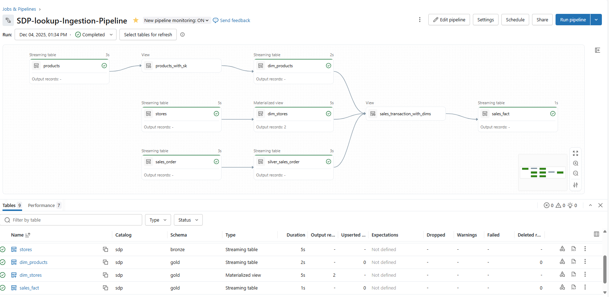
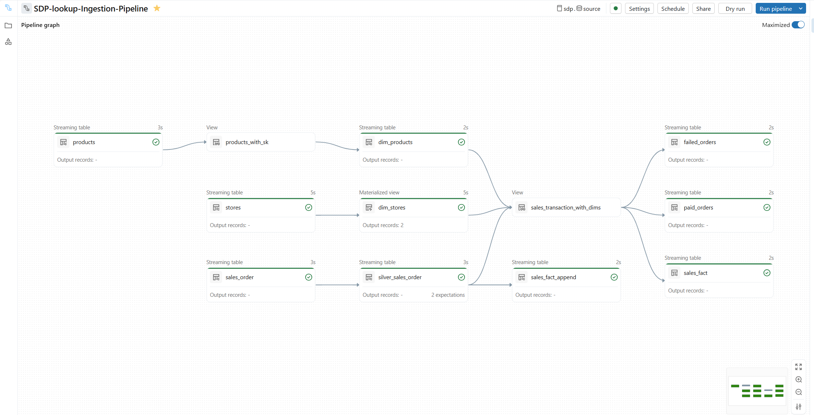
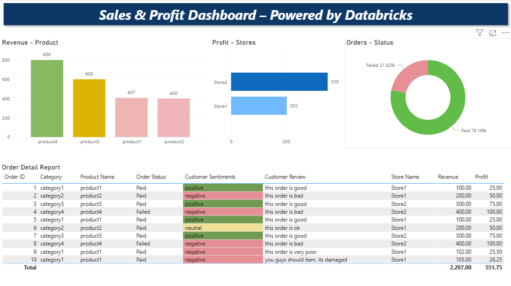

# Spark-Declarative-Pipeline

This folder defines all source code for the 'Spark-Declarative-Pipeline' pipeline:

- `explorations`: Ad-hoc notebooks used to explore the data processed by this pipeline.
- `transformations`: All dataset definitions and transformations.
- `utilities`: Utility functions and Python modules used in this pipeline.

#### Spark-Declarative-Pipeline
This pipeline leverages Databricks Lakeflow Declarative Pipelines to implement a robust medallion architecture (bronze, silver, gold layers) for both batch and streaming data. Key features include:

- **Streaming Tables**: Real-time ingestion and processing using Lakeflow streaming tables.
- **Materialized Views**: Fast, query-optimized tables for downstream analytics.
- **Temporary Views**: Flexible, in-memory transformations for intermediate logic.
- **Append Flows**: Efficiently appends new data to target tables.
- **SCD Type 1 & 2**: Handles Slowly Changing Dimensions for accurate historical tracking.
- **Dynamic Table Creation**: Uses metadata-driven for-loops to read and write tables programmatically.
- **Expectations**: Automatically enforce data quality rules during pipeline execution, ensuring only valid and trusted data flows through
- **Declarative Syntax**: Clean, maintainable code using Lakeflow's Python and SQL APIs.

### Pipeline Iteration one

### Pipeline Iteration Two with Dynamically target creation  & Append Flow

### Output: Powerbi

## Getting Started

To get started, go to the `transformations` folder -- most of the relevant source code lives there:

* By convention, every dataset under `transformations` is in a separate file.
  Read more about the syntax at:  
  https://spark.apache.org/docs/4.1.0-preview1/declarative-pipelines-programming-guide.html  
  https://docs.databricks.com/ldp/developer/python-ref  

For more tutorials and reference material, see https://docs.databricks.com/ldp.
